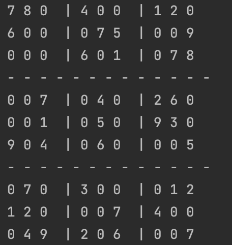

# Sudo Solution

## pseudo: 
1. pick empty square 
2. try all numbers(1-9)
3. Find one that fits(no same number in same row & column)
4. repeat(1-3) for next empty square 
5. backtrack (if there is no possible to find number that fit both row & column)
    back to previous empty number and increase number 

## The algorithm applied in this projects:
    - recursion 
    - double matrix 

## Results 

